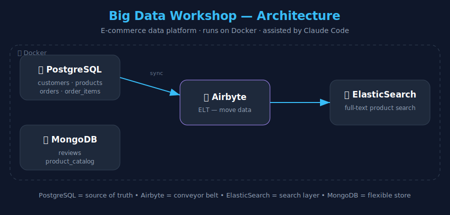

<!-- 🌐 Language: English (this file) · [ไทย](README.md) -->

# 🗃️ Big Data Workshop — Build Your Own Mini Data Platform

A hands-on Big Data workshop for **beginners**, themed around an **online store (E-commerce)**.
We gradually assemble three kinds of databases and connect them with a data-integration tool.

> 🤖 Every module is designed to be used with **Claude Code** — instead of memorizing commands, "describe what you want in plain language" and let Claude help write queries / configs / fix problems.

---

## 🧩 The Stack & why each piece exists

| Tool | What it is | Used for in this workshop |
|------|-----------|---------------------------|
| 🐘 **PostgreSQL** | Relational database | Core store data: customers, products, orders |
| 🍃 **MongoDB** | Document database (NoSQL) | Flexible reviews & product catalog |
| 🔎 **ElasticSearch** | Search engine | Fast full-text product search with ranking |
| 🔄 **Airbyte** | ELT / data-movement tool | Pull data from Postgres → elsewhere automatically |
| 🐳 **Docker** | Runs all the services | Boot the whole stack with one command |
| 🤖 **Claude Code** | AI assistant | Help write queries, fix configs, debug, explain |

---

## 🗺️ Architecture



**The story:** data is scattered across three databases (relational, document, search) → use Airbyte to bring it together → make it searchable/analyzable → everything containerized with Docker → with Claude Code as your assistant.

---

## 🚀 Quick Start

You'll need **Docker Desktop** installed ([download](https://www.docker.com/products/docker-desktop/)).

```bash
cp .env.example .env       # 1) copy settings
docker compose up -d       # 2) boot the stack
docker compose ps          # 3) check services are up
bash data/seed/elasticsearch/load.sh   # 4) load products into ElasticSearch
```

> 💡 **Prefer shortcuts?** A `Makefile` is included — run `make up` → `make load` → `make verify`. See all commands with `make help`.

PostgreSQL and MongoDB load their sample data automatically on first start.

### 🔗 Web UIs after `docker compose up`

| Service | URL | Use |
|---------|-----|-----|
| Adminer (Postgres UI) | http://localhost:8080 | Manage PostgreSQL |
| Mongo Express | http://localhost:8081 | Manage MongoDB |
| Kibana | http://localhost:5601 | Query ElasticSearch |
| ElasticSearch API | http://localhost:9200 | Call via curl/REST |

---

## 🖥️ Teaching slides

Open [`slides.html`](slides.html) in a browser (just double-click, no internet needed).
Use ← → arrows or Spacebar to navigate — great for projecting in class.

🌐 **Three languages: EN / TH / 中文** — toggle with the button at the top-right (your choice is remembered).

---

## 📚 The 8 modules

| # | Module | Learn |
|---|--------|-------|
| 0 | [Setup](modules/00-setup/README.md) | Install Docker + Claude Code |
| 1 | [Docker basics](modules/01-docker/README.md) | Boot the stack, understand containers |
| 2 | [PostgreSQL](modules/02-postgresql/README.md) | SQL, joins, table design |
| 3 | [MongoDB](modules/03-mongodb/README.md) | Document model, aggregation |
| 4 | [ElasticSearch](modules/04-elasticsearch/README.md) | Full-text search, query DSL |
| 5 | [Compare the 3 databases](modules/05-compare/README.md) | Which one, when |
| 6 | [Airbyte](modules/06-airbyte/README.md) | Move data between systems |
| 7 | [End-to-End Pipeline](modules/07-pipeline/README.md) | Connect it all |
| 8 | [Final project](modules/08-project/README.md) | Build a mini data platform |

> Module guides are currently written in Thai; the slides cover all content in EN/TH/CN.

---

## 🧰 Extras in this repo

| File / folder | Purpose |
|---------------|---------|
| `Makefile` | Shortcut commands (`make up/down/load/verify/quality/...`) |
| `scripts/verify.sh` | Check all services are up and data is loaded |
| `scripts/data_quality.sh` | Data-quality checks on PostgreSQL |
| `queries/` | Ready-to-run query sets for all 3 databases |
| `submissions/` | Where students submit final-project work |
| [`INSTRUCTOR.md`](INSTRUCTOR.md) | Teaching guide (schedule + troubleshooting) |

---

## 🛑 Wrap up / clean the machine

```bash
docker compose down       # stop services (keep data)
docker compose down -v    # stop + delete all data, fresh start
```
